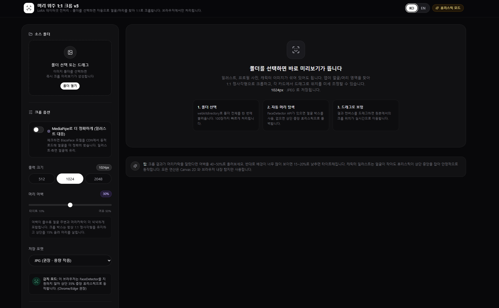
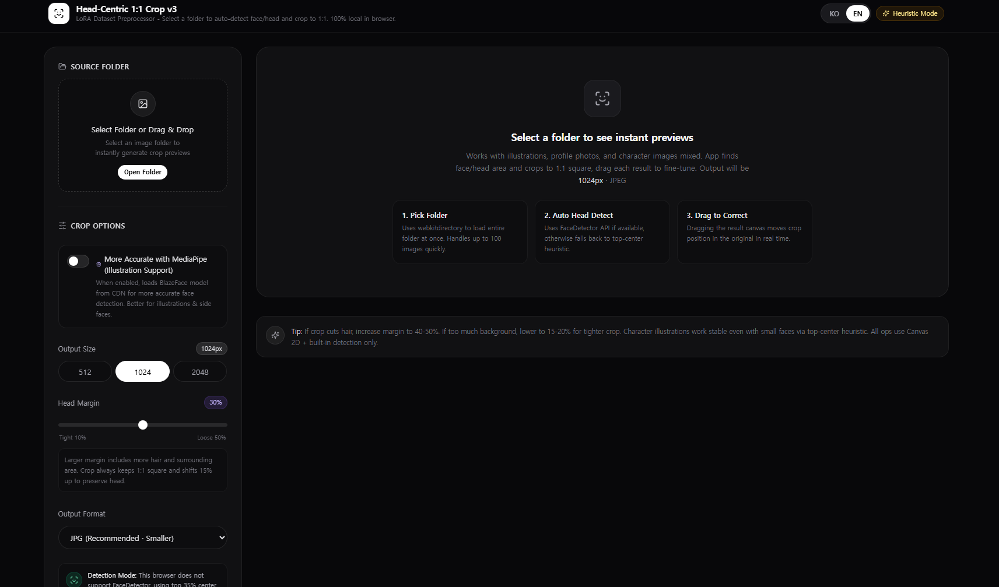

# Single-Called-Head-Crop | LoRA Dataset Preprocessor
> 🌐 **한글/영문 다국어 지원** - `index.html` 우상단 KO/EN 버튼으로 언어 전환 가능!
> 🌐 **Bilingual (KO/EN)** - Switch language with KO/EN button on top right!

Ostris AI-Toolkit, Kohya_ss LoRA 학습을 위한 **얼굴/머리 위주 1:1 크롭 전처리 툴**

> 학습 이미지가 제각각이라 LoRA가 얼굴을 못 배우나요? 폴더 하나 지정하면 자동으로 머리 중심으로 1:1 크롭해서 LoRA 학습에 최적화된 데이터셋을 만들어줍니다.

| 한글 | 영문 |
| :---: | :---: |
|  |  |

**Live Demo:** https://daning1212.github.io/Single-Called-Head-Crop/

### 🌐 언어
`index.html` 우상단 KO/EN 버튼으로 한글/영문 전환 가능 - 단일 파일로 다국어 지원

### 왜 필요한가? (for LoRA)
- **SDXL / Pony / Illustrious LoRA**는 얼굴 비율이 일정해야 잘 배웁니다
- 이 툴로 **1024x1024 1:1 정사각형, 머리 중심**으로 통일하면 trigger word 인식률 UP

### 기능
- **Batch Crop**: 폴더 통째로 100장까지 한 번에 처리
- **Head-Centric**: FaceDetector / MediaPipe BlazeFace 자동 탐지
- **LoRA Ready**: 512 / 1024 / 2048px, JPG/PNG/WebP
- **Manual Adjust**: 드래그로 미세 조정 (intuitive)
- **3가지 저장**: 폴더에 바로 저장 / ZIP / 개별 다운로드
- **100% Local**: 서버 업로드 없음

### 추천 세팅
| 모델 | 해상도 | 여백 |
| :--- | :--- | :--- |
| SDXL, Pony | 1024px | 30% |
| SD1.5 | 512px | 25% |
| Illustrious | 1024px | 35% |

### ✨ 주요 기능

- **폴더 일괄 처리**: `webkitdirectory`로 이미지 폴더 통째로 선택
- **머리 위주 크롭**: FaceDetector API로 얼굴을 찾고, 없으면 일러스트 대응 휴리스틱(상단 35% 중앙)으로 폴백
- **1:1 비율 고정**: 머리 위쪽 여백을 15% 더 확보해서 정수리 짤림 방지
- **실시간 보정**: 크롭 결과 드래그로 위치 미세 조정 가능
- **원클릭 저장**: JPG / PNG / WebP, 512 / 1024 / 2048px 해상도 선택, JSZip으로 전체 ZIP 다운로드

### 🚀 사용 방법

1. `index.html` 파일을 브라우저로 열기 (설치 필요 없음)
2. 왼쪽 패널에서 **폴더 선택** 또는 드래그 앤 드롭
3. 오른쪽 그리드에서 크롭 결과 확인
4. 마음에 안 들면 이미지를 드래그해서 위치 조정
5. 오른쪽 상단에서 포맷/해상도 선택 후 **전체 ZIP 다운로드**

### 🛠️ 기술 스택

- Vanilla JS + HTML5 Canvas
- [FaceDetector API](https://developer.mozilla.org/en-US/docs/Web/API/FaceDetector) (지원 시) - 없으면 휴리스틱
- [JSZip](https://stuk.github.io/jszip/) - 클라이언트 ZIP 생성

서버, 빌드, npm 없이 단일 HTML 파일로 동작합니다.

### 📁 프로젝트 구조

```
/
├── index.html      # 단일 파일 앱 (이 파일 하나만 있으면 됨)
└── README.md
```

### 🎨 이런 분께 추천

- 프로필 사진 1:1로 통일해야 하는 경우
- 일러스트/버튜버/캐릭터 머리 위주로 썸네일 뽑을 때
- 학습 데이터셋용 얼굴 크롭 전처리

### ⚙️ 옵션 설명

- **머리 여백**: 얼굴 크기에 대한 패딩. 30%가 가장 무난함
- **해상도**: 출력 캔버스 크기. 원본보다 크게 설정해도 업스케일 됨

### 🔒 프라이버시

모든 처리는 브라우저 내부에서만 일어납니다. 이미지가 외부 서버로 전송되지 않습니다.

### 📄 라이선스


- [ ] MediaPipe Face Mesh 모델로 일러스트 인식률 개선
- [ ] 눈 기준 정렬 (eye-alignment) 옵션
- [ ] 배경 제거 + 투명 배경 1:1 크롭

---
만든 사람: Healing arty
문의: Issues 탭에 남겨주세요!
### License
MIT


