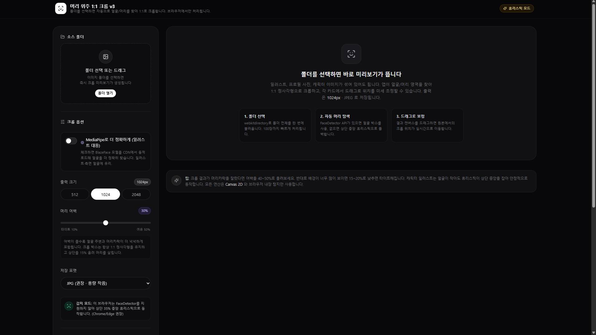

# Single-Called-Head-Crop | LoRA Dataset Preprocessor
> 🌐 **한글/영문 다국어 지원** - `index.html` 우상단 KO/EN 버튼으로 언어 전환 가능!
> 🌐 **Bilingual (KO/EN)** - Switch language with KO/EN button on top right!

Ostris AI-Toolkit, Kohya_ss LoRA 학습을 위한 **얼굴/머리 위주 1:1 크롭 전처리 툴**

> 학습 이미지가 제각각이라 LoRA가 얼굴을 못 배우나요? 폴더 하나 지정하면 자동으로 머리 중심으로 1:1 크롭해서 LoRA 학습에 최적화된 데이터셋을 만들어줍니다.

**Live Demo:** https://daning1212.github.io/Single-Called-Head-Crop/

### 🌐 언어
`index.html` 우상단 KO/EN 버튼으로 한글/영문 전환 가능 - 단일 파일로 다국어 지원

### 왜 필요한가? (for LoRA)
- **SDXL / Pony / Illustrious LoRA**는 얼굴 비율이 일정해야 잘 배웁니다
- 이 툴로 **1024x1024 1:1 정사각형, 머리 중심**으로 통일하면 trigger word 인식률 UP

### 기능
- **Batch Crop**: 폴더 통째로 100장까지 한 번에 처리
- **Head-Centric**: FaceDetector / MediaPipe BlazeFace 자동 탐지
- **LoRA Ready**: 512 / 1024 / 2048px, JPG/PNG/WebP
- **Manual Adjust**: 드래그로 미세 조정 (intuitive)
- **3가지 저장**: 폴더에 바로 저장 / ZIP / 개별 다운로드
- **100% Local**: 서버 업로드 없음

### 추천 세팅
| 모델 | 해상도 | 여백 |
| :--- | :--- | :--- |
| SDXL, Pony | 1024px | 30% |
| SD1.5 | 512px | 25% |
| Illustrious | 1024px | 35% |

### License
MIT
